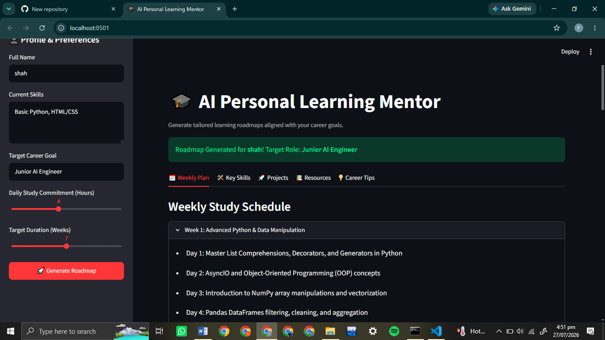

# AI Personal Learning Mentor

An AI-powered EdTech application designed to generate personalized learning roadmaps, weekly study plans, project ideas, and career guidance tailored to a user's current skills and career goals.

## Core Features

* **Personalized Roadmaps:** Generates step-by-step guidance based on user goals and daily study hours.
* **Structured JSON Output:** Uses Pydantic and Gemini native structured outputs for consistent data responses.
* **Interactive UI:** Built with Streamlit for an intuitive user experience.
* **Export Data:** Allows users to download their custom study plan as a JSON file.

## Tech Stack

* **Language:** Python
* **LLM API:** Google Gemini API (gemini-2.5-flash)
* **Data Validation:** Pydantic
* **Frontend:** Streamlit

## System Architecture

```text
[ User Input (Streamlit UI) ]
           │
           ▼
[ Prompt Construction & Context Injection ]
           │
           ▼
[ Gemini 2.5 Flash API (Structured JSON Mode) ]
           │
           ▼
[ Pydantic Schema Validation (schemas.py) ]
           │
           ▼
[ Render UI Tabs & JSON Download Option ]
```

## Prompt Engineering Strategy

1. **Persona Definition:** Configures the model to act as an expert EdTech Career and Learning Mentor.
2. **Context Injection:** Dynamically passes user name, current skills, target career goal, and available daily hours into the prompt.
3. **Schema Enforcement:** Applies strict response structure using `response_schema=RoadmapResponse` to eliminate formatting errors and guarantee valid JSON.

## Installation and Setup Instructions

### 1. Clone the Repository
```bash
git clone [https://github.com/SyedFahadHussain-ship-it/ai-learning-mentor.git](https://github.com/SyedFahadHussain-ship-it/ai-learning-mentor.git)
cd ai-learning-mentor
```

### 2. Set Up Virtual Environment

#### Windows
```bash
python -m venv venv
venv\Scripts\activate
```

#### macOS / Linux
```bash
python3 -m venv venv
source venv/bin/activate
```

### 3. Install Dependencies
```bash
pip install -r requirements.txt
```

### 4. Configure Environment Variables
Create a `.env` file in the root directory and add your Google Gemini API key:
```env
GEMINI_API_KEY=your_gemini_api_key_here
```

### 5. Run the Application
```bash
streamlit run app.py
```

## Screenshots

*
